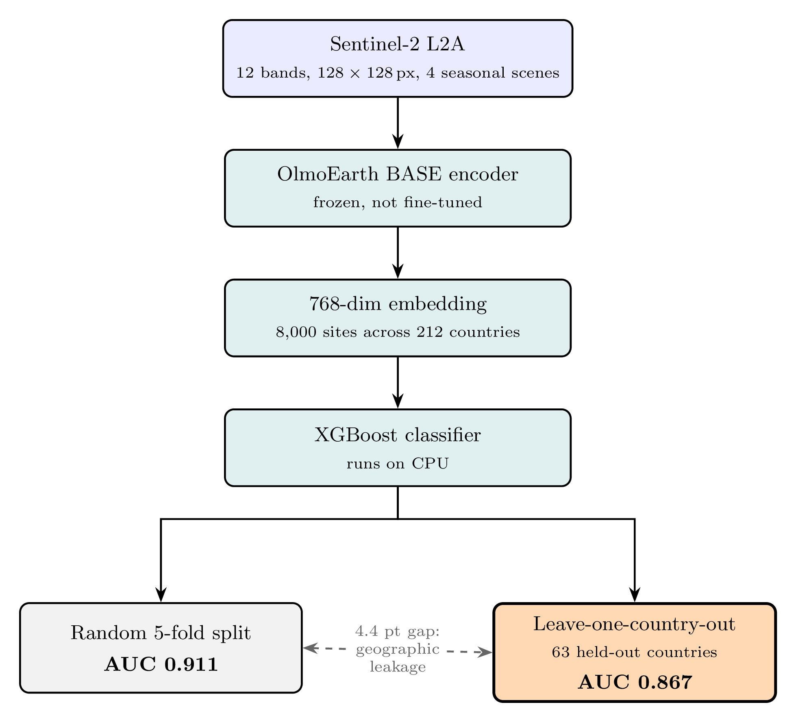

# O3 EartH

**Geospatial Site Suitability Assessment Using Foundation Model Embeddings**

Do frozen geospatial foundation model embeddings predict renewable energy site suitability in countries never seen during training? Across 8,000 sites in 212 countries, leave-one-country-out AUC is **0.867**. Random 5-fold CV gives 0.911; the 4.4-point gap is geographic leakage. Scoring runs on CPU.

<p align="center">
  
</p>

## Method

- **Data.** 8,000 sites across 212 countries and 4 energy types. Positives are existing plants; negatives are random global locations matched by type count.
- **Input.** Sentinel-2 L2A patches, 12 bands, 128x128 px at 10 m. Four seasonal scenes for solar, wind and hydro; a single scene for geothermal.
- **Encoder.** OlmoEarth BASE, frozen and never fine-tuned, pooled to one 768-dim vector per site.
- **Classifier.** XGBoost on the embedding. No GPU at scoring time.
- **Evaluation.** Random 5-fold CV, and leave-one-country-out over the 63 countries holding at least 5 positives and 5 negatives. The second is the number reported: the first leaks geography between nearby train and test points.

Because negatives are random locations, a score measures how much a site resembles places where plants already exist, not economic viability, permitting, or output.

## Results

| What | Number | Note |
|------|--------|------|
| Spatial CV, leave-one-country-out, 63 countries | **0.867 ± 0.114** | Conservative headline. [VALIDATION.md](docs/VALIDATION.md) |
| 5-fold stratified CV, embeddings only | 0.911 ± 0.015 | Folds .911/.898/.894/.917/.934. [json](results/suitability/suitability_results.json) |
| Ablation: coordinates / embeddings / both | 0.852 / 0.913 / 0.927 | Embeddings add +6.1 pts over coordinates alone. [json](results/suitability/suitability_results.json) |
| Random-label control | 0.497 | Expected ~0.50, so no memorization. [VALIDATION.md](docs/VALIDATION.md) |
| Regional spread, 6 continents | 0.866 Asia to 0.943 South America | [json](results/suitability/suitability_results.json) |
| Later re-run: spatial CV / overall CV | 0.904 / 0.924 | Higher, but no code here reproduces it. [json](results/suitability/suitability_results_v3.json) |
| Re-run per type: solar/geothermal/hydro/wind | 0.959 / 0.930 / 0.918 / 0.898 | n = 3,205 / 260 / 1,281 / 3,254. Random split, not spatial. [json](results/suitability/suitability_results_v3.json) |

Re-run the ablation and 5-fold CV:

```bash
python scripts/train_suitability.py \
  --embeddings data/embeddings_v3/embeddings.npy \
  --metadata data/embeddings_v3/embeddings_meta.csv \
  --cv-folds 5 --output-dir results/rerun
```

Same pipeline, different inputs: the committed results came from the earlier `embeddings/` set, which lives on Hugging Face and is gitignored here. **No script in this repo reproduces the leave-one-country-out or v3 numbers.**

## Install and run

```bash
git clone https://github.com/2imi9/O3earth.git
cd O3earth && pip install -r requirements.txt
cd platform && docker compose up --build
```

Open [localhost:8501](http://localhost:8501). Optional keys (`NVIDIA_API_KEY`, `EIA_API_KEY`) go in `platform/.env`; see [PLATFORM.md](docs/PLATFORM.md).

## Repository layout

```
scripts/            Embedding extraction, dataset build, training
src/                Scoring engine, factors, API clients, MCP tools
platform/           Web app
data/embeddings_v3/ 8,000 x 768 embeddings + metadata
results/            Trained models and metrics
docs/               Validation docs and figures
```

## Docs and data

- [VALIDATION.md](docs/VALIDATION.md): ablation, cross-validation, spatial CV, temporal validation, sanity checks
- [RESULTS.md](docs/RESULTS.md): result summary
- [PLATFORM.md](docs/PLATFORM.md): architecture and MCP tools
- [2imi9/O3earth](https://huggingface.co/datasets/2imi9/O3earth) on Hugging Face: dataset and trained models (models sit inside the dataset repo under `models/` and `models_v3/`; there is no separate model page)

## References

- [OlmoEarth](https://github.com/allenai/olmoearth_pretrain): Allen Institute geospatial foundation model
- [TIML](https://arxiv.org/abs/2209.06277) (Tseng et al.): methodological precedent for embedding + classifier approach
- [SatCLIP](https://arxiv.org/abs/2311.17179) (Klemmer et al.): location embeddings from satellite imagery

## Citation

See [CITATION.cff](CITATION.cff).

## License

MIT
