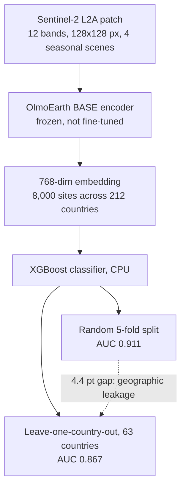

# O3 EartH

**Geospatial Site Suitability Assessment Using Foundation Model Embeddings**

O3 EartH scores renewable energy site suitability from frozen [OlmoEarth](https://github.com/allenai/olmoearth_pretrain) satellite embeddings with lightweight classifiers. Scoring runs on CPU.

> Ziming Qi | Northeastern University



## Overview

**Question.** Do frozen embeddings from a geospatial foundation model carry site-suitability information that simple geographic features do not already provide, and does it survive testing on countries never seen in training?

**Method.** 8,000 locations, 212 countries, 4 energy types. Each location is a Sentinel-2 L2A patch (12 bands, 128x128 px at 10 m; 4 seasonal scenes, single scene for geothermal) passed through a frozen OlmoEarth BASE encoder to give one 768-dim vector, then classified by XGBoost. Positives are existing energy sites, negatives are random global locations matched by type count.

**Answer.** Leave-one-country-out spatial CV across 63 countries gives **0.867 ± 0.114**. This is the headline number because it removes geographic leakage. Random 5-fold CV gives **0.911 ± 0.015**; the 4.4-point gap is the leakage that random splits hide.

**The gain over geography is modest.** Coordinate-derived features alone reach **0.852**, embeddings alone **0.913**, both together **0.927**. The foundation model adds about **+6.1 points**, not a jump from near chance. An earlier README reported a 0.579 geographic baseline; no result file supports it and it has been removed.

**What is not identifiable.** Labels separate built sites from random locations, so the model learns landscape resemblance to existing plants, not economic viability, permitting, or output. Geothermal has 260 samples, too few to call stable. The multi-temporal claim (T=4 over T=1) is **not established here**: [test_multitemporal.py](scripts/test_multitemporal.py) implements the comparison but saves no output, so no T=1 result exists in this repo.

## Key results

| What | Number | Note |
|------|--------|------|
| Spatial CV, leave-one-country-out, 63 countries | **0.867 ± 0.114** | Conservative headline. [VALIDATION.md](docs/VALIDATION.md) |
| 5-fold stratified CV, embeddings only | **0.911 ± 0.015** | Folds .911/.898/.894/.917/.934. [json](results/suitability/suitability_results.json) |
| Ablation: coordinates / embeddings / both | 0.852 / 0.913 / 0.927 | Embeddings add +6.1 pts. [json](results/suitability/suitability_results.json) |
| Random-label control | 0.497 | Expected ~0.50, so no memorization. [VALIDATION.md](docs/VALIDATION.md) |
| Regional spread, 6 continents | 0.866 Asia to 0.943 South America | [json](results/suitability/suitability_results.json) |
| Later re-run: spatial CV / overall CV | 0.904 / 0.924 | Higher, but no code here reproduces it. [json](results/suitability/suitability_results_v3.json) |
| Re-run per type: solar/geothermal/hydro/wind | 0.959 / 0.930 / 0.918 / 0.898 | n = 3,205 / 260 / 1,281 / 3,254. Random split, not spatial. [json](results/suitability/suitability_results_v3.json) |

Re-run the ablation and 5-fold CV:

```bash
python scripts/train_suitability.py \
  --embeddings data/embeddings_v3/embeddings.npy \
  --metadata data/embeddings_v3/embeddings_meta.csv \
  --cv-folds 5 --output-dir results/rerun
```

Same pipeline, different inputs: the committed results came from the earlier `embeddings/` set, which lives on Hugging Face and is gitignored here. **No script in this repo reproduces the leave-one-country-out or v3 numbers.**

## Status

- **Done.** Extraction pipeline, 8,000-location dataset over 212 countries, per-type XGBoost classifiers, ablation and 5-fold CV with saved results, plus a FastAPI + Streamlit platform with MCP tools scoring stored embeddings on CPU.
- **Open.** No committed script regenerates the spatial CV or v3 results, and the v1 embeddings behind the documented numbers are gitignored, so a fresh clone cannot re-derive them. The T=1 vs T=4 comparison needs a run that saves output. Dataset is versioned by directory convention only (`embeddings/` + `models/` alongside `embeddings_v3/` + `models_v3/` on Hugging Face), with no tags in either repo.
- **Known limitations.** Random negatives mean scores measure resemblance to built sites, not viability. Geothermal n=260. Spatial CV deviation is wide (±0.114), so per-country performance varies. [VALIDATION.md](docs/VALIDATION.md), [CITATION.cff](CITATION.cff) and the Hugging Face card still quote the older run and are not yet reconciled.

## Platform

FastAPI + Streamlit, three pages: **AI Chat** (NVIDIA NIM), **Site Selection** (map, Factor Engine + ML scores), **Climate Risk** (NASA POWER + IPCC AR6 SSP). The Factor Engine scores 19 configurable factors from live APIs, separate from the ML path. MCP tools included. See [PLATFORM.md](docs/PLATFORM.md).

Data sources: NASA POWER, Open-Elevation, Open-Meteo Flood, USGS Earthquake, Planetary Computer (all keyless) and EIA API v2 (key required).

## Install and run

```bash
git clone https://github.com/2imi9/O3earth.git
cd O3earth && pip install -r requirements.txt
cp platform/.env.example platform/.env   # optional keys
```

```bash
cd platform && docker compose up --build
# or: uvicorn api.main:app --port 8000  +  streamlit run ui/app.py --server.port 8501
```

Open [localhost:8501](http://localhost:8501). Site Selection and Climate Risk work without keys. AI Chat needs `NVIDIA_API_KEY` ([build.nvidia.com](https://build.nvidia.com/)); US plant data needs `EIA_API_KEY` ([eia.gov/opendata](https://www.eia.gov/opendata/register.php)).

## Repository layout

```
src/factors/        19 scoring factors (rule-based engine)
src/scoring/        Suitability engine
src/data_clients/   API clients
src/mcp/            MCP tools + handlers
src/llm/            NVIDIA NIM client
platform/           FastAPI backend + Streamlit frontend
scripts/            Data pipeline, embedding extraction, training
data/embeddings_v3/ 8,000 x 768 embeddings + metadata
results/            Trained models and metrics
docs/               Validation and platform docs
```

## Docs and data

- [VALIDATION.md](docs/VALIDATION.md): ablation, cross-validation, spatial CV, temporal validation, sanity checks
- [RESULTS.md](docs/RESULTS.md): result summary
- [PLATFORM.md](docs/PLATFORM.md): architecture and MCP tools
- [2imi9/O3earth](https://huggingface.co/datasets/2imi9/O3earth) on Hugging Face: dataset and trained models (models sit inside the dataset repo under `models/` and `models_v3/`; there is no separate model page)

## References

- [OlmoEarth](https://github.com/allenai/olmoearth_pretrain): Allen Institute geospatial foundation model
- [TIML](https://arxiv.org/abs/2209.06277) (Tseng et al.): methodological precedent for embedding + classifier approach
- [SatCLIP](https://arxiv.org/abs/2311.17179) (Klemmer et al.): location embeddings from satellite imagery

## Citation

See [CITATION.cff](CITATION.cff).

## License

MIT
